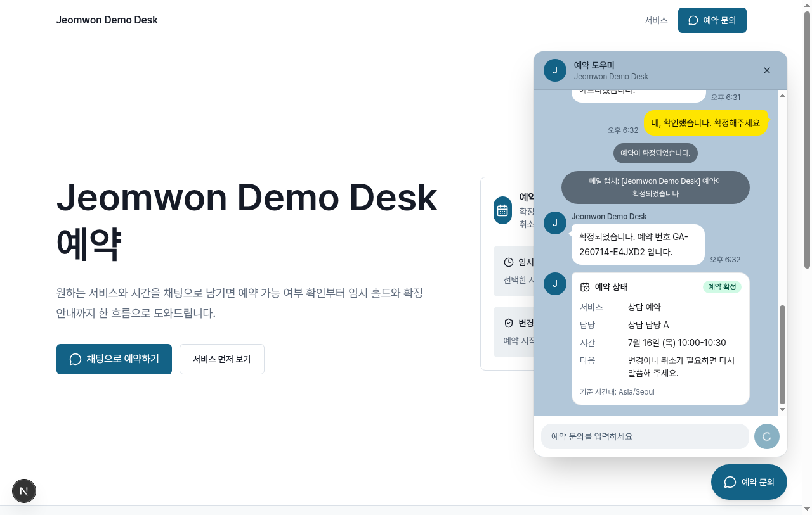
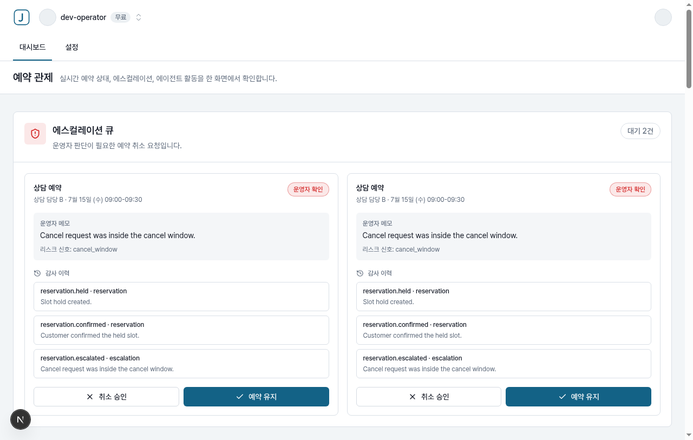

[한국어](README.md) · [English](README.en.md)

# jeomwon (점원)

[](https://github.com/NewTurn2017/jeomwon/actions/workflows/ci.yml)
[](LICENSE)

**점원(jeomwon)** — **도메인 인터뷰 한 번으로 소상공인용 예약 SaaS**를 뽑아주는 에이전트 킷. 마케팅 페이지, Google 로그인, 고객용 CS AI 챗, 관리자 대시보드, 수명주기 메일까지 Convex + Next.js 16 + bun 위에서.

공식 사이트: **[jeomwon.codewithgenie.com](https://jeomwon.codewithgenie.com)**

AI 점원이 가게 프런트를 지킵니다: 고객은 챗으로 예약·변경·취소하고, 불변식(슬롯 충돌, 홀드, 취소 가능 시간)은 Convex mutation 안에서 강제되며, 사장님은 실시간 대시보드로 전 과정을 지켜봅니다.

| 고객 — 카카오톡 스타일 예약 챗 | 사장님 — 운영자 대시보드 |
|---|---|
|  |  |

생성되는 UI는 그대로 상용 가능한 수준입니다: 라이트 톤의 도메인 인식 랜딩(서비스·영업시간·정책을 `domain.config`에서 렌더), 카카오톡 스타일 챗 위젯(좌우 말풍선, 한국어 상태 라벨, IME 안전 입력 — 원시 enum이나 API 에러를 고객에게 노출하지 않음), 그리고 행동 순서로 배치된 한국어 운영자 대시보드(에스컬레이션 큐 승인/유지 → 예약 목록 → 에이전트 활동 타임라인).

## 왜 점원인가

- **Cal.com은 예약 *앱*입니다** — 하나의 캘린더 제품을 운영자가 설정해서 씁니다. 점원은 업종 인터뷰로 **예약 SaaS 자체를 생성**합니다(미용실, PC방, 펜션이 각각 다른 앱으로 나옵니다).
- **v0·보일러플레이트는 *화면*을 줍니다** — 점원은 화면 밑에 슬롯 충돌·홀드 TTL·취소 기한이 **Convex mutation 안에서 강제되는 도메인 로직**까지 함께 줍니다.
- **배포 형태가 Claude Code 스킬입니다** — 코딩 에이전트가 인터뷰하고, 스캐폴드하고, 11게이트 라이브 QA로 스스로 증명합니다.

## 빠른 시작

**준비물**: [bun](https://bun.sh) 1.3+ (필수) · [Convex](https://convex.dev) 무료 계정(`bun setup` 도중 로그인) · 선택: Google OAuth 클라이언트, [Resend](https://resend.com)·[OpenAI](https://platform.openai.com) 키(없으면 메일 캡처 모드 + `mock` 에이전트 런타임으로 전부 동작)

### Claude Code로 (권장)

```bash
git clone https://github.com/NewTurn2017/jeomwon.git && cd jeomwon
ln -sfn "$(pwd)/skill" ~/.claude/skills/jeomwon
```

이후 Claude Code 세션에서 도메인을 설명하세요 (예: "PC방 좌석 예약 시스템 만들어줘"). 스킬이 도메인 팩 하나로 인터뷰한 뒤, 단일 **bootstrap** 커맨드로 `template/`에서 프로젝트를 스캐폴드하고, 도메인 팩을 주입하고, 오프라인 검증 게이트를 실행합니다. bootstrap은 오프라인 전용이라 라이브 QA도 `bun setup`도 실행하지 않습니다. 끝나면 생성물 경로와, 사용자가 직접 실행할 다음 단계(`bun setup` 대화형 자격증명 → `bun run qa` 라이브 11게이트)를 출력합니다.

시작 경로는 두 가지입니다. 레포 전체를 클론한 경우 `bun skill/scripts/bootstrap.mjs <target-dir> <project-name> <domain-pack.json>`가 로컬 `template/` 디렉터리를 그대로 사용합니다. `skill/`만 설치한 경우 `bun scripts/bootstrap.mjs <target-dir> <project-name> <domain-pack.json>`가 로컬 `template/`이 없으면 `JEOMWON_TEMPLATE_REF`(기본 `main`)의 GitHub tarball을 새로 내려받습니다. 오프라인 또는 사설 네트워크 검증에는 `JEOMWON_TEMPLATE_ARCHIVE=/path/to/jeomwon.tar.gz`를 지정하세요. 하위 커맨드 `scaffold.mjs`, `inject.mjs`, `verify.mjs`는 재실행·부분 실행용으로 그대로 남아 있습니다.

### Claude Code 없이

생성된 프로젝트(그리고 `template/` 자체)에는 자급자족 셋업 위저드가 내장돼 있습니다:

```bash
cd template
bun install
bun setup        # Convex 프로비저닝, JWT 키 생성, Google OAuth / Resend / OpenAI 안내
bun dev          # web + app + backend 병렬 실행
```

## 구성

| 경로 | 설명 |
|---|---|
| `template/` | 프로젝트 원본, jeomwon으로 풀 리브랜드 완료(get-convex/v1에서 파생, 핀은 `docs/upstream-report.md`에 기록): `domain.config.ts` 주도 에이전트(triage + 4), 카카오톡 스타일 챗 위젯, 운영자 대시보드, React Email 4종, `bun setup` 위저드 |
| `skill/` | Claude Code 스킬: `SKILL.md` fast path, `REFERENCE.md` 방법론, `EXAMPLES.md` 도메인 팩 10종(미용실, PC방, 도서관, 펜션, 스터디카페, 풋살장, 웨비나, 장비 대여, 필라테스, generic), `scripts/{bootstrap,scaffold,inject,verify}.mjs` |
| `samples/pension-stay/` | 셀프 증명: 킷으로 실제 생성한 펜션(일 단위 숙박) 프로젝트. 주기적으로 재생성하므로 최신 template보다 뒤처질 수 있음 |
| `docs/plan.md` | 살아있는 계획서 — 아키텍처 결정, 페이즈 로그, 백로그 |
| `upstream/` | get-convex/v1 읽기 전용 참조 클론 (gitignore 대상, 핀은 `docs/upstream-report.md`에 기록) |

## QA 게이트

각 트리에 11게이트 QA 스위트가 들어 있습니다(해피 패스, 취소 기한 에스컬레이션, 쓰기 가드, 관련성 가드, 스키마 422, 프라이버시 grep, 홀드 만료, 메일 캡처, 대기자 접수·알림, 운영자 캘린더 CRUD, 고객 계정). `bun run qa`가 Convex 준비, 웹 서버 기동, 11게이트 실행, 정리까지 스스로 처리합니다 — 서버를 미리 띄울 필요가 없습니다.

```bash
cd template
bun run qa
```

- 웹 서버는 기본 포트 `3999`로 뜹니다(`JEOMWON_QA_PORT`로 변경). 여러 프로젝트의 QA를 **동시에 돌리지 마세요** — 정리 단계에서 해당 포트를 점유한 프로세스를 종료합니다.
- 홀드 만료 게이트의 대기 시간은 `JEOMWON_TEST_HOLD_MS`(기본 `1500`)로 조절합니다.
- 안전장치: `dev:` 배포가 아니면 실행을 거부합니다. QA가 해당 도메인의 예약·챗 데이터를 초기화하기 때문입니다.
- 대기자 게이트(9)는 `features.waitlist`가 꺼져 있으면 결정론적으로 SKIP됩니다.

웹 서버를 이미 띄워둔 상태에서 게이트만 돌리려면 `bun run qa:run`을 쓰고 `JEOMWON_QA_BASE_URL`을 직접 지정하세요. Next dev 접속은 반드시 `localhost`로 해야 합니다(`127.0.0.1` 불가).

## 설정

`.env.local`은 `bun setup`이 대화형으로 생성하며 gitignore 대상입니다 — 이 레포에는 시크릿이 없습니다. 키 이름은 각 패키지의 `.env.example`에 문서화돼 있습니다:

- `apps/web/.env.example` — `NEXT_PUBLIC_CONVEX_URL`, `AGENT_RUNTIME` (`mock` | OpenAI), `OPENAI_API_KEY`
- `apps/app/.env.example` — 대시보드 앱 env
- `packages/backend/.env.example` — Convex 배포, `SITE_URL`, 선택적 Polar 키(`domain.config.features.polar`가 켜진 경우만)

## 아키텍처 규약

실제 디버깅에서 살아남은 불변식 10개는 `docs/plan.md` 3절에 기록돼 있습니다 — 핵심: 불변식은 Convex mutation 안에서, 시간대는 매장 TZ의 calendar parts로, SSE 금지(Convex `useQuery` 반응형), `PublicContext`는 정확히 8필드만 공개, `thread_id`는 대화 키일 뿐 인증이 아님.

## 상태

로드맵 Phase 0~7 완료 + UI 전면 재설계 완료(스타터 브랜딩 전면 제거, 재설계 후 template 라이브 QA 전 게이트 통과와 양 앱 브라우저 실증 확인). 레포는 공개 상태이고 스킬 단독 설치(scaffold의 GitHub tarball 폴백)가 동작합니다. 잔여 백로그: 전 과정 리허설, `samples/pension-stay` 재생성.

## 기여

새 업종 도메인 팩이 가장 좋은 첫 기여입니다 — 리소스 4종 × 슬롯 3종 × 위젯 2종 조합 중 아직 비어 있는 칸이 [skill/EXAMPLES.md](skill/EXAMPLES.md)의 Coverage Catalog에 정리돼 있습니다. 절차는 [CONTRIBUTING.md](CONTRIBUTING.md)를 참고하세요.

## 라이선스

[MIT](LICENSE). 벤더링된 `template/`·`samples/`는 파생원(get-convex/v1)의 원저작권 고지를 `template/LICENSE.md`에 유지합니다.
