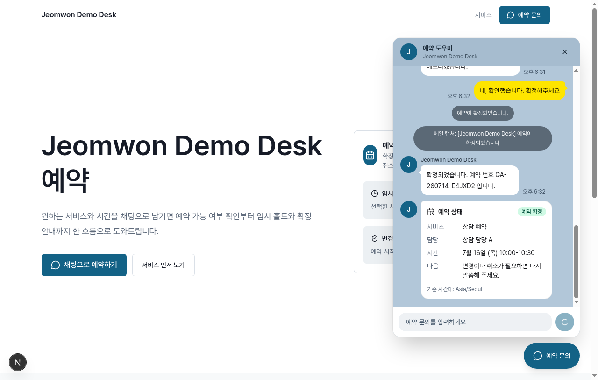
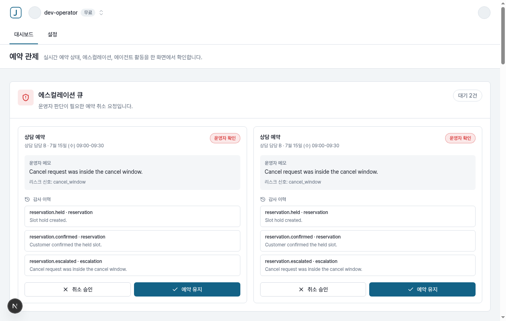

[한국어](README.md) · [English](README.en.md)

# jeomwon (점원)

[](https://github.com/NewTurn2017/jeomwon/actions/workflows/ci.yml)
[](LICENSE)

**점원(jeomwon)** — **도메인 인터뷰 한 번으로 소상공인용 예약 SaaS**를 뽑아주는 에이전트 킷. 마케팅 페이지, Google 로그인, 고객용 CS AI 챗, 관리자 대시보드, 수명주기 메일까지 Convex + Next.js 16 + bun 위에서.

공식 사이트: **[jeomwon.codewithgenie.com](https://jeomwon.codewithgenie.com)**

AI 점원이 가게 프런트를 지킵니다: 고객은 챗으로 예약·변경·취소하고, 불변식(슬롯 충돌, 홀드, 취소 가능 시간)은 Convex mutation 안에서 강제되며, 사장님은 실시간 대시보드로 전 과정을 지켜봅니다.

| 고객 — 카카오톡 스타일 예약 챗 | 사장님 — 운영자 대시보드 |
|---|---|
|  |  |

생성되는 UI는 그대로 상용 가능한 수준입니다: 라이트 톤의 도메인 인식 랜딩(서비스·영업시간·정책을 `domain.config`에서 렌더), 카카오톡 스타일 챗 위젯(좌우 말풍선, 한국어 상태 라벨, IME 안전 입력 — 원시 enum이나 API 에러를 고객에게 노출하지 않음), 그리고 행동 순서로 배치된 한국어 운영자 대시보드(에스컬레이션 큐 승인/유지 → 예약 목록 → 에이전트 활동 타임라인).

## 왜 점원인가

- **Cal.com은 예약 *앱*입니다** — 하나의 캘린더 제품을 운영자가 설정해서 씁니다. 점원은 업종 인터뷰로 **예약 SaaS 자체를 생성**합니다(미용실, PC방, 펜션이 각각 다른 앱으로 나옵니다).
- **v0·보일러플레이트는 *화면*을 줍니다** — 점원은 화면 밑에 슬롯 충돌·홀드 TTL·취소 기한이 **Convex mutation 안에서 강제되는 도메인 로직**까지 함께 줍니다.
- **배포 형태가 Claude Code 스킬입니다** — 코딩 에이전트가 인터뷰하고 스캐폴드하며 오프라인 검증을 실행합니다. setup 뒤의 QA contract v2(12게이트)는 별도 live 검증입니다.

## 빠른 시작

**준비물**: [bun](https://bun.sh) **1.3.14** (정확한 버전 필수) · [Convex](https://convex.dev) 무료 계정과 setup 전에 완료한 `bun x convex login` · Google 로그인을 위한 **필수 Google OAuth Web application client** · 선택: [Resend](https://resend.com)·[OpenAI](https://platform.openai.com) 키(없으면 메일 캡처 모드 + `mock` 에이전트 런타임 사용)

### Claude Code로 (권장)

```bash
git clone https://github.com/NewTurn2017/jeomwon.git && cd jeomwon
bunx --bun skills@1.5.22 add . --skill jeomwon --agent universal claude-code --global
# 수동 설치 대안: ln -sfn "$(pwd)/skill" ~/.claude/skills/jeomwon
```

이후 Claude Code 세션에서 도메인을 설명하세요 (예: "PC방 좌석 예약 시스템 만들어줘"). 스킬이 도메인 팩 하나로 인터뷰한 뒤, 단일 **bootstrap** 커맨드로 `template/`에서 프로젝트를 스캐폴드하고, 도메인 팩을 주입하고, 오프라인 검증 게이트를 실행합니다. bootstrap은 오프라인 전용이라 라이브 QA도 `bun setup`도 실행하지 않습니다. 끝나면 생성물 경로와, 사용자가 직접 실행할 다음 단계(`bun x convex login` → `bun setup`의 Google OAuth 2개 값·운영자 이메일 입력 → `bun run qa` 라이브 12게이트)를 출력합니다.

bootstrap은 target을 건드리기 전에 preflight를 실행합니다. 별도로 확인하려면 `bun "${CLAUDE_SKILL_DIR}/scripts/preflight.mjs" <target-dir> <project-name> <domain-pack.json>`를 실행하세요. 설치본은 skills CLI의 canonical 경로, Claude Code 링크, 수동 심볼릭 링크와 실제 `CLAUDE_SKILL_DIR` 값을 동일하게 해석하며, 체크인된 immutable archive와 두 SHA-256 계약을 검증합니다. `cache_not_ready`이면 출력되는 단 하나의 `warm-cache.mjs` 복구 argv를 네트워크가 허용된 시점에 그대로 실행한 뒤 preflight를 재실행합니다. 오프라인 verify가 네트워크를 대신 사용하지는 않습니다.

### Claude Code 없이

생성된 프로젝트(그리고 `template/` 자체)에는 자급자족 셋업 위저드가 내장돼 있습니다:

```bash
cd template
bun install --frozen-lockfile
bun x convex login
bun setup        # Convex/JWT + Google OAuth와 운영자 allowlist의 첫 성공 경로
bun dev          # web + app + backend 병렬 실행
```

setup schema 2는 이미 인증된 Convex CLI를 검증하고 dev deployment를 생성/재사용한 뒤, 기존 Google OAuth client의 redirect URI 등록을 사용자가 완료했는지 확인하고 client ID/secret과 운영자 allowlist를 Convex env에 설정합니다. setup 자체는 최종 사용자의 Convex/Google 로그인을 수행하지 않으며 provider 계정·DNS·OAuth client도 생성하지 않습니다. Resend·OpenAI·Polar는 선택 제공자 단계이고 Google 운영자 신원은 로컬 익명 고객 QA와 운영상 별개입니다.

## 구성

| 경로 | 설명 |
|---|---|
| `template/` | 프로젝트 원본, jeomwon으로 풀 리브랜드 완료(get-convex/v1에서 파생, 핀은 `docs/upstream-report.md`에 기록): `domain.config.ts` 주도 에이전트(triage + 4), 카카오톡 스타일 챗 위젯, 운영자 대시보드, React Email 4종, `bun setup` 위저드 |
| `skill/` | Claude Code 스킬: `SKILL.md` fast path, `REFERENCE.md` 방법론, `EXAMPLES.md` 도메인 팩 10종(미용실, PC방, 도서관, 펜션, 스터디카페, 풋살장, 웨비나, 장비 대여, 필라테스, generic), `scripts/{bootstrap,scaffold,inject,verify}.mjs` |
| `samples/pension-stay/` | 셀프 증명: 킷으로 실제 생성한 펜션(일 단위 숙박) 프로젝트. 주기적으로 재생성하므로 최신 template보다 뒤처질 수 있음 |
| `docs/plan.md` | 살아있는 계획서 — 아키텍처 결정, 페이즈 로그, 백로그 |
| `upstream/` | get-convex/v1 읽기 전용 참조 클론 (gitignore 대상, 핀은 `docs/upstream-report.md`에 기록) |

## QA 게이트

각 트리에 QA contract v2의 인증 앱 대상 12게이트 스위트가 들어 있습니다(기존 11개 + 노쇼 전이 경계). `bun run qa`가 Convex 준비, `apps/app` mock 런타임 기동, 독립 로그인 A/B 컨텍스트의 12게이트 실행, 정리까지 스스로 처리합니다 — 앱 서버를 미리 띄울 필요가 없습니다. 토글 off의 명시적 SKIP은 성공 증거가 아니며 on 상태의 설정 실패는 FAIL입니다.

```bash
cd template
bun run qa
```

- 인증 앱은 기본 포트 `3999`로 뜹니다(`JEOMWON_QA_PORT`로 변경). 시작 전 포트가 점유되어 있으면 Convex 변경이나 프로세스 기동 없이 실패하며, 정리 단계는 이 QA가 만든 전용 프로세스 그룹만 종료합니다.
- 로컬 Chromium이 아직 없으면 최초 1회 `cd template && bunx playwright install chromium`으로 QA 브라우저를 준비하세요.
- 홀드 만료 게이트의 대기 시간은 `JEOMWON_TEST_HOLD_MS`(기본 `1500`)로 조절합니다.
- 안전장치: `dev:` 배포가 아니면 실행을 거부합니다. QA가 해당 도메인의 예약·챗 데이터를 초기화하기 때문입니다.
- 대기자 게이트(9)는 `features.waitlist`가 꺼져 있으면 결정론적으로 SKIP됩니다.
- 게이트 10은 미인증 `/admin` redirect와 인증 고객 `/admin` 404를 항상 검증합니다. `features.operatorCalendarCrud=false`이면 CRUD 경계 하위 사례만 이유와 함께 SKIP하고, `true`이면 예약된 비일치 `.invalid` allowlist 아래에서 미인증·인증 비운영자의 create/update/delete 차단을 PASS로 증명합니다. 실제 Google 운영자 로그인과 성공 CRUD는 정확한 12게이트에 포함되지 않는 별도 maintainer-owned 라이브 smoke이며, 사용자 승인 전에는 BLOCKED입니다.
- 게이트 12는 `features.noShow=false`에서 무변경 SKIP하고, on이면 서버 권한의 과거 예약 전이와 무관 side-effect 불변을 검증합니다.

인증 앱을 이미 띄워둔 상태에서 게이트만 돌리려면 `bun run qa:run`을 쓰고 `JEOMWON_QA_BASE_URL`을 직접 지정하세요. Next dev 접속은 반드시 `localhost`로 해야 합니다(`127.0.0.1` 불가).

## 설정

`.env.local`은 `bun setup`이 대화형으로 생성하며 gitignore 대상입니다 — 이 레포에는 시크릿이 없습니다. 키 이름은 각 패키지의 `.env.example`에 문서화돼 있습니다:

- `apps/web/.env.example` — `NEXT_PUBLIC_CONVEX_URL`, `AGENT_RUNTIME` (`mock` | OpenAI), `OPENAI_API_KEY`
- `apps/app/.env.example` — 대시보드 앱 env
- `packages/backend/.env.example` — Convex 배포, `SITE_URL`, 선택적 Polar 계정-구독 키(`domain.config.features.polar`가 켜진 경우만)

Polar는 로그인 계정의 SaaS 구독 전용입니다. 서비스 `price`는 표시 문자열일 뿐이며 예약 보증금·예약 결제·환불·예약별 결제 ledger는 이 릴리스에 없습니다.

## 문서 계약 확인

아래 명령은 문서의 구조화 capability/QA/setup/release identity, domain-pack 예제와 9/24 coverage, 로컬 링크, 스크립트 help 계약을 machine source와 대조합니다.

```bash verify cwd=repo
bun skill/scripts/validate-doc-contracts.mjs --capabilities template/jeomwon-capabilities.json --project template/jeomwon-template.json --qa template/scripts/qa-contract.ts
```

오프라인 bootstrap의 `VERIFY PASS`는 install/typecheck/lint/tests/build 결과이며 live QA·배포·provider 성공이나 첫 사용자 소요시간 측정이 아닙니다. 생성물은 domain pack v1과 receipt v3를 쓰고, schemaVersion 없는 legacy v0 pack만 순수 migration으로 받습니다.

## 아키텍처 규약

실제 디버깅에서 살아남은 불변식 10개는 `docs/plan.md` 3절에 기록돼 있습니다 — 핵심: 불변식은 Convex mutation 안에서, 시간대는 매장 TZ의 calendar parts로, SSE 금지(Convex `useQuery` 반응형), `PublicContext`는 정확히 8필드만 공개, `thread_id`는 대화 키일 뿐 인증이 아님.

## 상태

로드맵 Phase 0~7 완료 + UI 전면 재설계 완료(스타터 브랜딩 전면 제거, 재설계 후 template 라이브 QA 전 게이트 통과와 양 앱 브라우저 실증 확인). 레포는 공개 상태이고 스킬 단독 설치(scaffold의 GitHub tarball 폴백)가 동작합니다. `samples/pension-stay`는 현행 template에서 bootstrap으로 재생성된 최신 상태입니다.

## 기여

새 업종 도메인 팩이 가장 좋은 첫 기여입니다 — 리소스 4종 × 슬롯 3종 × 위젯 2종 조합 중 아직 비어 있는 칸이 [skill/EXAMPLES.md](skill/EXAMPLES.md#coverage-catalog)의 Coverage Catalog에 정리돼 있습니다. 절차는 [CONTRIBUTING.md](CONTRIBUTING.md)를 참고하세요.

## 라이선스

[MIT](LICENSE). 벤더링된 `template/`·`samples/`는 파생원(get-convex/v1)의 원저작권 고지를 `template/LICENSE.md`에 유지합니다.
